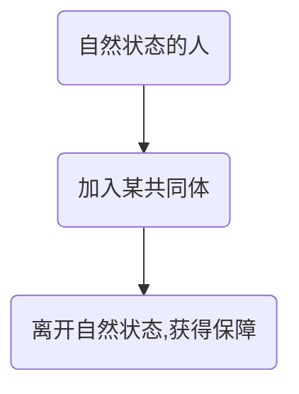

[toc]

# 第二章 论自然状态
自然法就是`理性`，自然状态是指在自然法的范围内自由地行动自己的人身、处理自己的财产的状态。这种状态无需获得许可，也无需听命于别人的意志。因此，所有人是平等的，即从`爱己`到`爱人`。人有处理的权利，但是没有毁灭的权利，所以不能侵害他人的生命、财产、自由、健康。
自然法由每一个人来执行，以**制止违反自然法**为度，因为没有人对他人拥有管辖权，所以任何人都有权去做。而惩罚的唯一理由就是`纠正和禁止作用`。犯罪行为的发生，表示罪犯破坏了自然法，是对全人类和平与安全的侵犯。因此人人应当制止。

作者的观点是，任何君主或国家对一个外国人在他们的国家中犯了任何罪行可以处以死刑或加以惩罚。即：任何人都要遵守当地法律。此外，受害者还有求偿权，其他人可以帮助受害人行使这一权利。
而惩罚的程度，应当是足以是罪犯觉得不足以犯罪，让他知道悔悟，并且儆戒别人不犯同样的罪行。法律的制定必须以自然法为根据。

这样做带来了一种反对意见，即将裁判权交给受害者本人不够合理(即应当交给君主等其他人)，但是君主一样是自私的，通常会带来更大的损害。而就现在而言，仍然有人生活在自然状态，就是各独立政府的一切统治者和君主。而契约本身并不会终止自然状态，只有订立结成国家的契约，才会终止自然状态。
但是，人类需要形成各种组织，进一步形成国家。这个过程催生了政治社会。

# 第八章 论政治社会的起源
## 结论

人们通过订立加入一个国家的契约，成为一个国家的成员。他们共同谋求舒适安全和和平的生活，安稳地享受他们的财产。但是，同时所有人都要服从全部决定，这些决定一般是大多数人的决定，而不是全体的决定。
因为，如果不服从全部决定，那就与完全不服从决定没有区别；而很难聚集全体人员去参与决定，所以要尽量靠大多数人来决定。由上，所有加入共同体的人，都必须`把联合成共同体这一目的所必须的一切权利都交给这个共同体的大多数`。

## 两种疑问
1. 找不到一群人建立政府的例子
2. 人不能自由建立新的政府

## 对第一种疑问的解答
人类确实有过自然状态的时期，只是很难找到记载。而在成书当时，美洲的一些地方依然没有政府。例如佛罗里达和吉利跨那的人只是在和平或战争的关头才选出领袖。而同时也确实有基于一群人的同意而建立起政府的例子。第三，王国一般源于大家族，而大家族的成员往往是自一开始就服从于家长的管理。
家长的位置往往会演变成继承制。而父权的存在主要是为了抵御外敌，和战本身仍然要靠商议决定。这种继承的家长位置也渐渐演变成法律条文化的规定，就形成了政治社会。当领导人专横和滥用权力时，他们的行为受到不满，才产生了“君权神授”的概念。

## 对第二种疑问的解答
假如某一个政府的臣民天生处于臣服状态，不可以另外创立一个新的政府：那么全球应当仅有一个国家、一个合法政府、一个合法君主。而事实证明，全世界有众多的国家，臣服是祖先放弃了自然自由，而后裔并不是必须受到约束。
例如，英国夫妇在法国生下孩子，孩子既不是英国国民，也不是法国国民。人受到世俗权力的制约，是因为他通过契约加入了某个共同体，但是如何界定`默认`和`拒绝`，作者认为，只要是占有这个政府的任何土地，就必须服从该政府的法律。而只要成员离开这片土地，就可以在一片无主土地上建立一个全新的国家。但是，仅仅默认地遵守所在国家的法律，并不意味着这个人加入了所在的国家。要想加入这个国家，仍然需要表达明确的同意。
